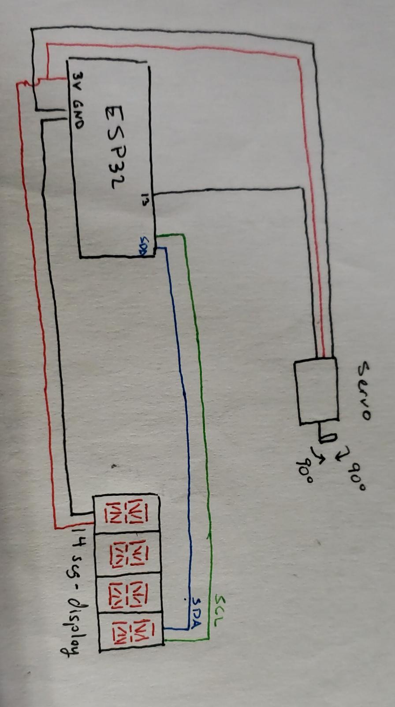
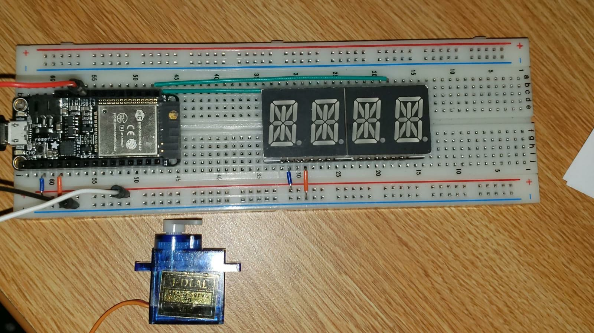
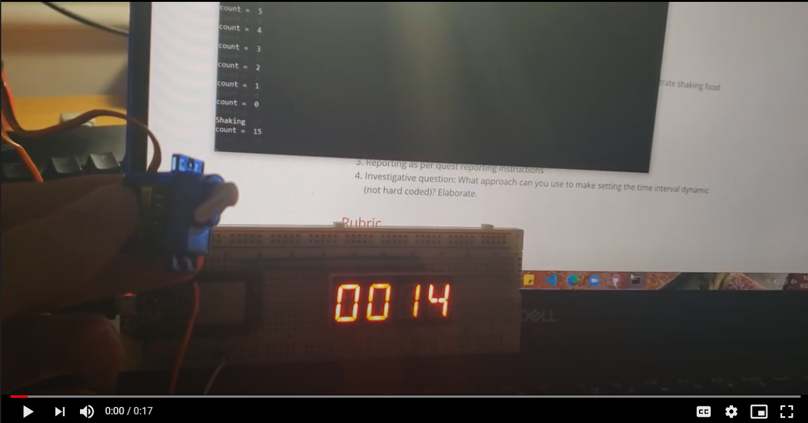

# Quest Name
Authors: Ece Birol, Gabriel Ramos, Brendan Sable

Date: 2020-09-22
-----

## Summary

The task at hand was to develop a timed fish feeding system. This would combine all of the skills from the pertaining cluster. We combined the use of a servo, the 14 segment display and the ESP32 to accomplish this. The code initializes the display and the pertaining pins. An initial design consisted of setting a countdown timer of 15 seconds through the use of modulus. Once the time passes, a function to activate the servo is called with a vTaskDelay between shifts.  

Investigative questions: 
    What approach can you use to make setting the time interval dynamic (not hard coded)? Elaborate.

    In order to make the time interval dynamic, there could be several approaches. For instance, one could take in a user input to change the intervals that they desire when they initialize the product. Another approach could be with the implementation of more sensors to decide how the program should decide when to feed the animals. These could be sensors for daylight or by the weight of the container (checking how much food is left). 

## Self-Assessment

### Objective Criteria

| Objective Criterion | Rating | Max Value  | 
|---------------------------------------------|:-----------:|:---------:|
| Objective One |  |  1     |       1         |
| Objective Two |  |  1     |       1         |
| Objective Three |  |  1     |     1         |
| Objective Four |  |  1     |      1         |
| Objective Five |  |  1     |      1         |
| Objective Six |  |  1     |       n/a       |
| Objective Seven |  |  1     |     1         |

### Qualitative Criteria

| Qualitative Criterion | Rating | Max Value  | 
|---------------------------------------------|:-----------:|:---------:|
| Quality of solution |  |  5     |       3
| Quality of report.md including use of graphics |  |  3     |      3
| Quality of code reporting |  |  3     |       2
| Quality of video presentation |  |  3     |       1

## Solution Design

The solution design was aimed towards maintaining a clean, simple and efficient look. Aside from that the design followed the one instructed from the Alphanumeric I2C Display with the added servo.

## Sketches and Photos

  

 The image above demonstrates the circuit set up in order to test the code. The wires are color coded for ease of visibility and undestanding. 

The figure above presents the physicial setup of the board that imitates the circuit drawing provided previously.

## Supporting Artifacts

This video is presents the original concept for counting down to activate the servo:
- (https://drive.google.com/file/d/11FQ1tGG6YgDUnX_ngiswFYWdyIu3MIny/view?usp=sharing)

It counts down in 15 second intervals and then "shakes" the container by rotating the servo 3 times.

## References

The sources used for this project were those provided in our online textbook for our individual skill assessments as well as the example code provided by the ESP32, 14 seg display and the class materials.

-----

